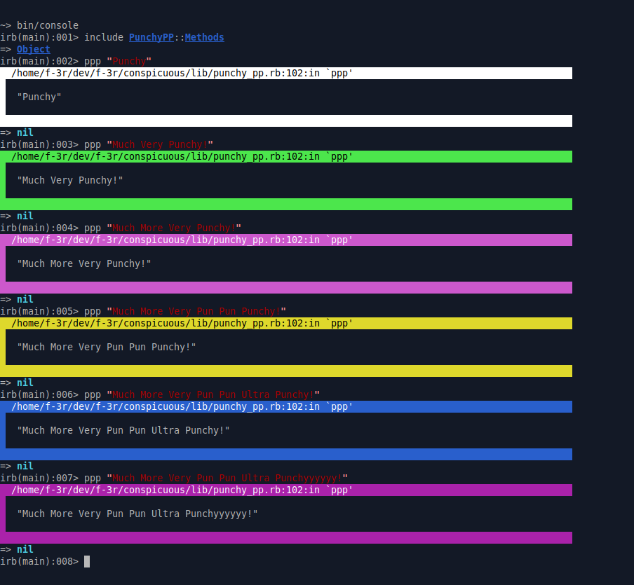

# Punchy PP

_A "whistle key finder" for you *puts*_


## WhAt?

* Are you a [puts debuguerer](https://tenderlovemaking.com/2016/02/05/i-am-a-puts-debuggerer/)?
* You tired of playing 'Where's Waldo' with your `puts`?
* Sick of losing and forgeting where the heck you've _put_ them?
* Or perhaps diying of boredom while scrolling through and endless river of uninteresting logs?

If any of these is a **YES**, then, my dear friend, here I've got some well-deserved **punchy** for your puts'es

## Usage
If you are using Rails, `bundle add punchy_pp` or `gem install punchy_pp` and you are good to go.

If not, then you also need to include punchy_pp's printer method `#ppp` in the top-level object, like so:

```ruby
require "punchy_pp" 
include PunchyPP::Methods

ppp "Punchy"
```

And you'll get something like:



## Development, Contributing, License, CoC, etc, etc, etc

MIT, Contributor Covenant Code of Conduct, etc, all the standard stuff Bundler happily made for us all :grinning: Just reach out with an issue or PR